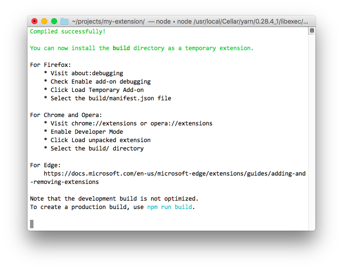
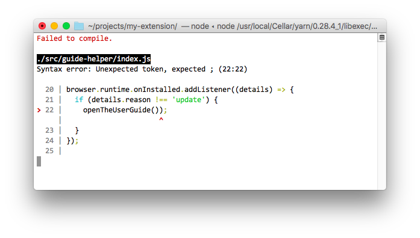

# Create React WebExtension [](https://travis-ci.org/facebookincubator/create-react-app)

Develop WebExtensions with no build configuration.<br>

WebExtension API is the widely adopted system for extending and modifying the capability of a browser.<br>

* [Quick Start](#quick-start) – How to create a new extension.
* [User Guide](https://github.com/constfun/create-react-WebExtension/blob/master/packages/react-scripts/template/README.md) – How to develop extensions bootstrapped with Create React WebExtension.
* [WebExtensions on MDN](https://developer.mozilla.org/en-US/Add-ons/WebExtensions) - API reference and tutorials for developing extensions.
* [Examples](https://github.com/mdn/webextensions-examples) - Example extensions from MDN.

**This project is a fork of the excellent [Create React App (CRA)](https://github.com/facebookincubator/create-react-app) project.**

The latest version of Create React WebExtension (CRWX) is in sync with [create-react-app#v1.0.10](https://github.com/facebookincubator/create-react-app/tree/v1.0.10).<br>

## Highlights

- Get started immediately, no need to install or configure tools like Webpack or Babel.<br>
They are preconfigured and hidden so that you can focus on the code.
- Live reload of JavaScript and CSS as you work on your extension. Works seamlessly in Chrome, Firefox, and Opera, even on pages protected by HTTPS and Content Security Policy.
- You can use TypeScript, Ocaml, ReasonML, or JavaScript and import modules between them.
- At any time, you can "eject" Create React WebExtension from your project to relinquish full control over the webpack configuration.

## Limitations

- Although based on a mature project, this is a new project that introduces significant changes. You'd be an early adopter.
- The User Guide is 90% relevant, but hasn't been updated yet. This project is mostly a super set of CRA features.
- No Windows support.
- The example extension works in all major browsers. However, CRWX does not automatically make your extension code cross platform. To target multiple browsers you have to take care to use [polyfills](https://github.com/mozilla/webextension-polyfill) and to not use incompatible properties in the `manifest.json` file. 
- CRWX will create a production build, ready for packaging. However, the packaging process itself varries significantly between browsers and is considered out of scope for this project.

If something doesn’t work please be kind and [report an issue](https://github.com/constfun/create-react-WebExtension/issues/new).

## Quick Start

### Installation

Install [yarn](https://yarnpkg.com/lang/en/docs/install/) or [npm](https://www.npmjs.com/get-npm).

Install [facebookincubator/create-react-app](https://github.com/facebookincubator/create-react-app) once globally:

```sh
yarn global add create-react-app
```

### Create a New Extension

To start working on a new extension, run:

```sh
create-react-app my-extension --scripts-version react-scripts-webextension
cd my-extension
yarn start
```

Follow the instructions on the screen to install the extension in your browser:



Once installed in your browser, the example extension navigates to the [latest version of the User Guide](https://github.com/constfun/create-react-WebExtension/blob/master/packages/react-scripts/template/README.md) and injects itself as a [content script](https://developer.mozilla.org/en-US/Add-ons/WebExtensions/Content_scripts) on that page.

## Directory Structure

The directory structure of a newly generated project looks like this:
```
.
|– package.json
|– README.md         # The User Guide.
|– public            # Contents of this folder are copied as is into the build.
|  |– manifest.json  # The all important manifest file for your extension.
|  |– icon-48.png       
|  |– js
|     |– browser-polyfill.js  # Polyfills Chrome with newer APIs, optional.
|– src
   |– index.js       # Entry point for the build/js/index.js bundle.
   |– guide              
      |– _bundle     # Tells us to bundle the code in this directory separately.
      |– index.js    # The entry point for the resulting build/js/guide.js bundle.
      |– index.css   # Imported from and hence is bundled with index.js.
      ...
```

## List of Commands

Create React WebExtension supports five commands:

* `start` - Build and watch the extension in development mode.
* `test` - Run the test watcher in an interactive mode.
* `build` - Create a production build.
* `inject` - Add support files for additional programming languages.
* `eject` - Remove Create React WebExtension from your project and relinquish control.

Each command is described in more detail bellow.

### `yarn start` (or `npm run start`)


Running `yarn start` populates the `build/` directory with the development build of the example extension.<br>


Changing any JavaScript in the `src/` directory or any file in the `public/` directory will intelligently reload the extension and affected tabs.

Changing any CSS in the `src/` directory will live update the extension on the screen, without reloading.

You will see the build errors and lint warnings in the console.



### `yarn test` (or `npm run test`)

By default, runs tests related to files changed since the last commit.

[Read more about testing.](https://github.com/facebookincubator/create-react-app/blob/master/packages/react-scripts/template/README.md#running-tests)

### `yarn build` (or `npm run build`) 

When you’re ready to package your extension for distribution, create minified code with `yarn build`.

Since the procedure for packaging extensions varries significantly between browsers and distribution channels, you will have to do this step manually or using additional tools.

### `yarn inject` or `npm run inject`


You can use TypeScript, Ocaml, ReasonML, or JavaScript to develop extensions with Create React WebExtension.

Using the command `yarn inject` you can add the required files, along with a friendly example, for each supported language:


## Starting an Extension from Scratch

1. Delete everything from the `src` and `public` directories. 
2. Run `yarn start` and follow the error messages.

Happy hacking!

﹎,﹎_﹎:cactus:_﹎﹎:camel:﹎

<br>
<br>
<br>
<br>
<br>
<br>


### `npm start` or `yarn start`

Runs the app in development mode.<br>
Open [http://localhost:3000](http://localhost:3000) to view it in the browser.

The page will reload if you make edits.<br>


### `npm run build` or `yarn build`

Builds the app for production to the `build` folder.<br>
It correctly bundles React in production mode and optimizes the build for the best performance.

The build is minified and the filenames include the hashes.<br>
By default, it also [includes a service worker](https://github.com/facebookincubator/create-react-app/blob/master/packages/react-scripts/template/README.md#making-a-progressive-web-app) so that your app loads from local cache on future visits.

Your app is ready to be deployed.

## User Guide

The [User Guide](https://github.com/facebookincubator/create-react-app/blob/master/packages/react-scripts/template/README.md) includes information on different topics, such as:

- [Updating to New Releases](https://github.com/facebookincubator/create-react-app/blob/master/packages/react-scripts/template/README.md#updating-to-new-releases)
- [Folder Structure](https://github.com/facebookincubator/create-react-app/blob/master/packages/react-scripts/template/README.md#folder-structure)
- [Available Scripts](https://github.com/facebookincubator/create-react-app/blob/master/packages/react-scripts/template/README.md#available-scripts)
- [Supported Language Features and Polyfills](https://github.com/facebookincubator/create-react-app/blob/master/packages/react-scripts/template/README.md#supported-language-features-and-polyfills)
- [Syntax Highlighting in the Editor](https://github.com/facebookincubator/create-react-app/blob/master/packages/react-scripts/template/README.md#syntax-highlighting-in-the-editor)
- [Displaying Lint Output in the Editor](https://github.com/facebookincubator/create-react-app/blob/master/packages/react-scripts/template/README.md#displaying-lint-output-in-the-editor)
- [Formatting Code Automatically](https://github.com/facebookincubator/create-react-app/blob/master/packages/react-scripts/template/README.md#formatting-code-automatically)
- [Debugging in the Editor](https://github.com/facebookincubator/create-react-app/blob/master/packages/react-scripts/template/README.md#debugging-in-the-editor)
- [Changing the Page `<title>`](https://github.com/facebookincubator/create-react-app/blob/master/packages/react-scripts/template/README.md#changing-the-page-title)
- [Installing a Dependency](https://github.com/facebookincubator/create-react-app/blob/master/packages/react-scripts/template/README.md#installing-a-dependency)
- [Importing a Component](https://github.com/facebookincubator/create-react-app/blob/master/packages/react-scripts/template/README.md#importing-a-component)
- [Code Splitting](https://github.com/facebookincubator/create-react-app/blob/master/packages/react-scripts/template/README.md#code-splitting)
- [Adding a Stylesheet](https://github.com/facebookincubator/create-react-app/blob/master/packages/react-scripts/template/README.md#adding-a-stylesheet)
- [Post-Processing CSS](https://github.com/facebookincubator/create-react-app/blob/master/packages/react-scripts/template/README.md#post-processing-css)
- [Adding a CSS Preprocessor (Sass, Less etc.)](https://github.com/facebookincubator/create-react-app/blob/master/packages/react-scripts/template/README.md#adding-a-css-preprocessor-sass-less-etc)
- [Adding Images, Fonts, and Files](https://github.com/facebookincubator/create-react-app/blob/master/packages/react-scripts/template/README.md#adding-images-fonts-and-files)
- [Using the `public` Folder](https://github.com/facebookincubator/create-react-app/blob/master/packages/react-scripts/template/README.md#using-the-public-folder)
- [Using Global Variables](https://github.com/facebookincubator/create-react-app/blob/master/packages/react-scripts/template/README.md#using-global-variables)
- [Adding Bootstrap](https://github.com/facebookincubator/create-react-app/blob/master/packages/react-scripts/template/README.md#adding-bootstrap)
- [Adding Flow](https://github.com/facebookincubator/create-react-app/blob/master/packages/react-scripts/template/README.md#adding-flow)
- [Adding Custom Environment Variables](https://github.com/facebookincubator/create-react-app/blob/master/packages/react-scripts/template/README.md#adding-custom-environment-variables)
- [Can I Use Decorators?](https://github.com/facebookincubator/create-react-app/blob/master/packages/react-scripts/template/README.md#can-i-use-decorators)
- [Integrating with an API Backend](https://github.com/facebookincubator/create-react-app/blob/master/packages/react-scripts/template/README.md#integrating-with-an-api-backend)
- [Proxying API Requests in Development](https://github.com/facebookincubator/create-react-app/blob/master/packages/react-scripts/template/README.md#proxying-api-requests-in-development)
- [Using HTTPS in Development](https://github.com/facebookincubator/create-react-app/blob/master/packages/react-scripts/template/README.md#using-https-in-development)
- [Generating Dynamic `<meta>` Tags on the Server](https://github.com/facebookincubator/create-react-app/blob/master/packages/react-scripts/template/README.md#generating-dynamic-meta-tags-on-the-server)
- [Pre-Rendering into Static HTML Files](https://github.com/facebookincubator/create-react-app/blob/master/packages/react-scripts/template/README.md#pre-rendering-into-static-html-files)
- [Running Tests](https://github.com/facebookincubator/create-react-app/blob/master/packages/react-scripts/template/README.md#running-tests)
- [Developing Components in Isolation](https://github.com/facebookincubator/create-react-app/blob/master/packages/react-scripts/template/README.md#developing-components-in-isolation)
- [Making a Progressive Web App](https://github.com/facebookincubator/create-react-app/blob/master/packages/react-scripts/template/README.md#making-a-progressive-web-app)
- [Analyzing the Bundle Size](https://github.com/facebookincubator/create-react-app/blob/master/packages/react-scripts/template/README.md#analyzing-the-bundle-size)
- [Deployment](https://github.com/facebookincubator/create-react-app/blob/master/packages/react-scripts/template/README.md#deployment)
- [Advanced Configuration](https://github.com/facebookincubator/create-react-app/blob/master/packages/react-scripts/template/README.md#advanced-configuration)
- [Troubleshooting](https://github.com/facebookincubator/create-react-app/blob/master/packages/react-scripts/template/README.md#troubleshooting)

A copy of the user guide will be created as `README.md` in your project folder.

## How to Update to New Versions?

Please refer to the [User Guide](https://github.com/facebookincubator/create-react-app/blob/master/packages/react-scripts/template/README.md#updating-to-new-releases) for this and other information.

## Philosophy

* **One Dependency:** There is just one build dependency. It uses Webpack, Babel, ESLint, and other amazing projects, but provides a cohesive curated experience on top of them.

* **No Configuration Required:** You don't need to configure anything. Reasonably good configuration of both development and production builds is handled for you so you can focus on writing code.

* **No Lock-In:** You can “eject” to a custom setup at any time. Run a single command, and all the configuration and build dependencies will be moved directly into your project, so you can pick up right where you left off.

## Why Use This?

**If you’re getting started** with React, use `create-react-app` to automate the build of your app. There is no configuration file, and `react-scripts` is the only extra build dependency in your `package.json`. Your environment will have everything you need to build a modern React app:

* React, JSX, ES6, and Flow syntax support.
* Language extras beyond ES6 like the object spread operator.
* A dev server that lints for common errors.
* Import CSS and image files directly from JavaScript.
* Autoprefixed CSS, so you don’t need `-webkit` or other prefixes.
* A `build` script to bundle JS, CSS, and images for production, with sourcemaps.
* An offline-first [service worker](https://developers.google.com/web/fundamentals/getting-started/primers/service-workers) and a [web app manifest](https://developers.google.com/web/fundamentals/engage-and-retain/web-app-manifest/), meeting all the [Progressive Web App](https://github.com/facebookincubator/create-react-app/blob/master/packages/react-scripts/template/README.md#making-a-progressive-web-app) criteria.

**The feature set is intentionally limited**. It doesn’t support advanced features such as server rendering or CSS modules. The tool is also **non-configurable** because it is hard to provide a cohesive experience and easy updates across a set of tools when the user can tweak anything.

**You don’t have to use this.** Historically it has been easy to [gradually adopt](https://www.youtube.com/watch?v=BF58ZJ1ZQxY) React. However many people create new single-page React apps from scratch every day. We’ve heard [loud](https://medium.com/@ericclemmons/javascript-fatigue-48d4011b6fc4) and [clear](https://twitter.com/thomasfuchs/status/708675139253174273) that this process can be error-prone and tedious, especially if this is your first JavaScript build stack. This project is an attempt to figure out a good way to start developing React apps.

### Converting to a Custom Setup

**If you’re a power user** and you aren’t happy with the default configuration, you can “eject” from the tool and use it as a boilerplate generator.

Running `npm run eject` copies all the configuration files and the transitive dependencies (Webpack, Babel, ESLint, etc) right into your project so you have full control over them. Commands like `npm start` and `npm run build` will still work, but they will point to the copied scripts so you can tweak them. At this point, you’re on your own.

**Note: this is a one-way operation. Once you `eject`, you can’t go back!**

You don’t have to ever use `eject`. The curated feature set is suitable for small and middle deployments, and you shouldn’t feel obligated to use this feature. However we understand that this tool wouldn’t be useful if you couldn’t customize it when you are ready for it.

## Limitations

Some features are currently **not supported**:

* Server rendering.
* Some experimental syntax extensions (e.g. decorators).
* CSS Modules.
* Importing LESS or Sass directly ([but you still can use them](https://github.com/facebookincubator/create-react-app/blob/master/packages/react-scripts/template/README.md#adding-a-css-preprocessor-sass-less-etc)).
* Hot reloading of components.

Some of them might get added in the future if they are stable, are useful to majority of React apps, don’t conflict with existing tools, and don’t introduce additional configuration.

## What’s Inside?

The tools used by Create React App are subject to change.
Currently it is a thin layer on top of many amazing community projects, such as:

* [webpack](https://webpack.js.org/) with [webpack-dev-server](https://github.com/webpack/webpack-dev-server), [html-webpack-plugin](https://github.com/ampedandwired/html-webpack-plugin) and [style-loader](https://github.com/webpack/style-loader)
* [Babel](http://babeljs.io/) with ES6 and extensions used by Facebook (JSX, [object spread](https://github.com/sebmarkbage/ecmascript-rest-spread/commits/master), [class properties](https://github.com/jeffmo/es-class-public-fields))
* [Autoprefixer](https://github.com/postcss/autoprefixer)
* [ESLint](http://eslint.org/)
* [Jest](http://facebook.github.io/jest)
* and others.

All of them are transitive dependencies of the provided npm package.

## Contributing

We'd love to have your helping hand on `create-react-app`! See [CONTRIBUTING.md](CONTRIBUTING.md) for more information on what we're looking for and how to get started.

## React Native

Looking for something similar, but for React Native?<br>
Check out [Create React Native App](https://github.com/react-community/create-react-native-app/).

## Acknowledgements

We are grateful to the authors of existing related projects for their ideas and collaboration:

* [@eanplatter](https://github.com/eanplatter)
* [@insin](https://github.com/insin)
* [@mxstbr](https://github.com/mxstbr)

## Alternatives

* [mi-g/weh](https://github.com/mi-g/weh)
* [mozilla/web-ext](https://github.com/mozilla/web-ext)
* [flybayer/create-react-webextension](https://github.com/flybayer/create-react-webextension)